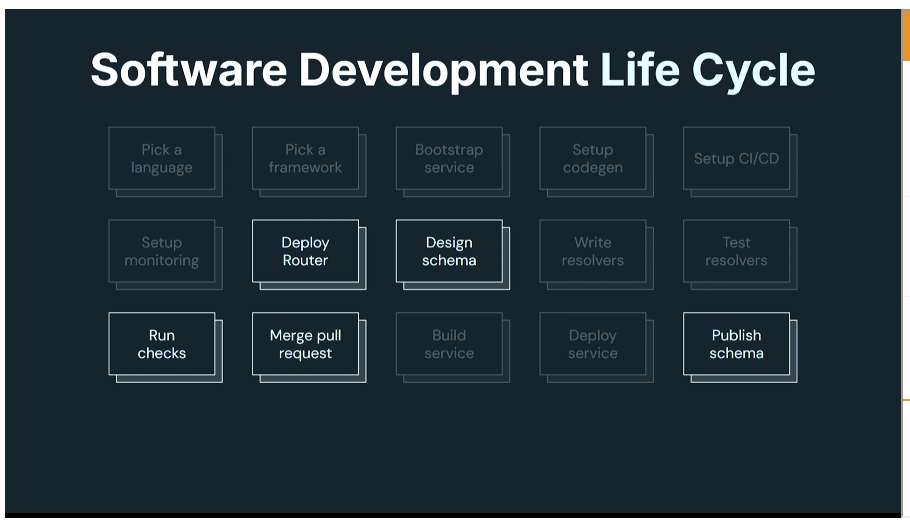
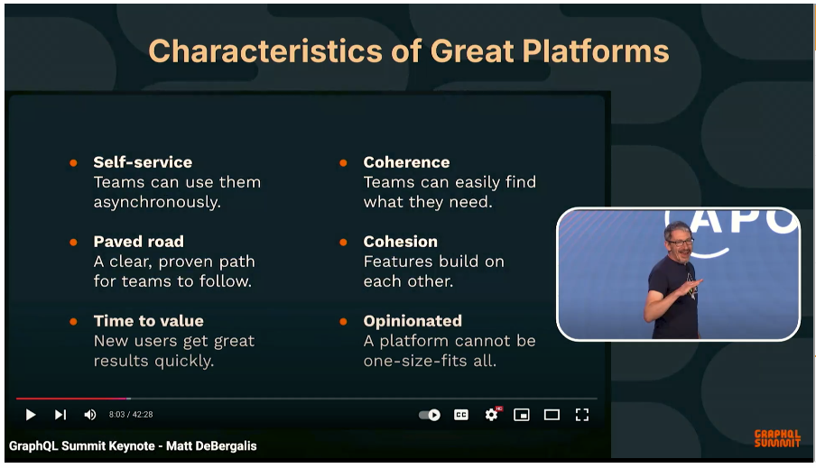
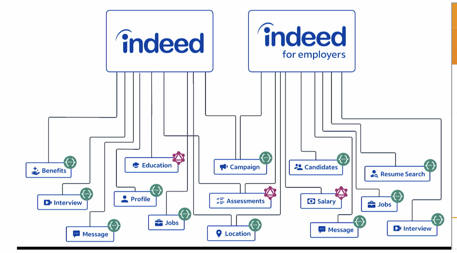
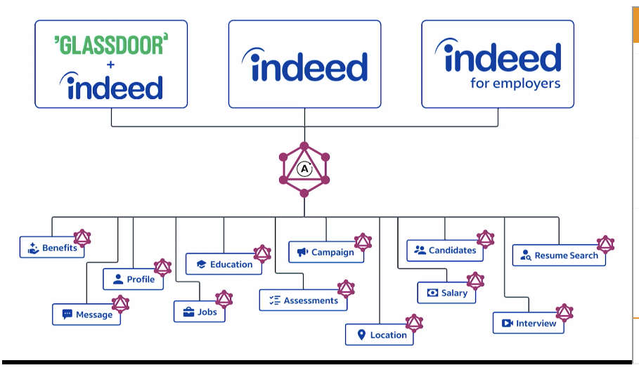
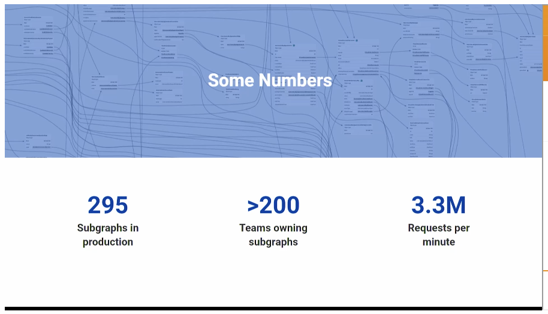

# summit.graphql 2024

My notes from the Apollo GraphQL Virtual Summit 2024

## Keynote : The Value of your API Platform, Today and Tomorrow

- apollo is trying to bring graphql into the architecture, not replace other service types (REST, SOAP, etc...)
- use graphql to coordinate how your other APIs are called
- @connectors - new feature in apollo platform offerings
- Apollo Language Server - schema validation/intellisense for GraphQL Schema and Queries
- "Entity Caching" - DOW Jones saw 20-25% decrease in response time, 8-10x reduction in load on underlying services
- "Demand Control" - can limit sub-graph calls based on costs. Tools exist to observe and monitor the query costs
- "Query Planner" - rewrite from JS to Rust (cool). 10x improvement of query plan time. 5.5x less CPU consumption

## Keynote : Exploring Apollo's new Products, a deep dive

- graphql can be an abstraction between UI and API, which helps integrations for NEW fragments of the graph, or seamless deployments
- the conversion journey has challenges, but the overall benefits outweigh the cost of those challenges.
- @router and @connector have transforms built right in.
- @router - reduces the SDLC steps required
  

## What's new in Apollo Client

When you're ready, definitely check out our Swift & Apollo courses on Odyssey! https://www.apollographql.com/tutorials/apollo-ios-swift-part1

- Apollo Client is actually 3 different clients, TS, Swift and Kotlin
- TTL example - https://gist.github.com/bignimbus/ccb1010183447689ac7bc25df022481a
- OSS
- GraphQL Testing Library
- has browser DevTools extensions for debugging
  - has cache explorer (like ReactQuery!!)
- Has IDE extensions

## Turning your graph into a developer platform

Introducing GraphOS!!

- Automate => Measure => Adapt
- Allows for schema versioning with PRs and included Checks (PR Validation)
- Allows for custom checks
- No server required to have a graphql endpoint

## Introducing a native query planner in Apollo Router

- comparison in Expedia - https://github.com/samuelAndalon/query-planner-service-comparison
- 10x reduction in response times
- 2.2 - 5.5x reduction in CPU usage
- can see MASSIVE reduction in RAM usage (2.049 GB => 0.49 MB)
- 
- biggest reason for conversion from JS to Rust is transformation of data between the router (Rust) and the JS Query Planner
- 2nd reason in memory usage and detecting memory used between the two processes

## Fake it 'til You Build it : Navigating GraphQL Mocking Solutions

- allows builders and consumers to collaborate and test experiments together
- allows consumers to validate the contract by mocking data for all + edge case tests

## OneGraph : Indeed as a Platform

how a proof of concept and an API First mandate transformed our culture and led to OneGraph, which provides access to over **200 subgraphs** and serves **120B requests** per month

- in the last 6 years have converted from mixed ecosystem to supergraph
- step one was to add graph to each side of their API platform(s)/BFF
- Easily incorporated another client application
- built a lot of validation into build pipelines, etc.
- brought in Apollo engineers to train in-house engineers in the migration to the graph way

## Apollo Language Server: The subgraph DX
